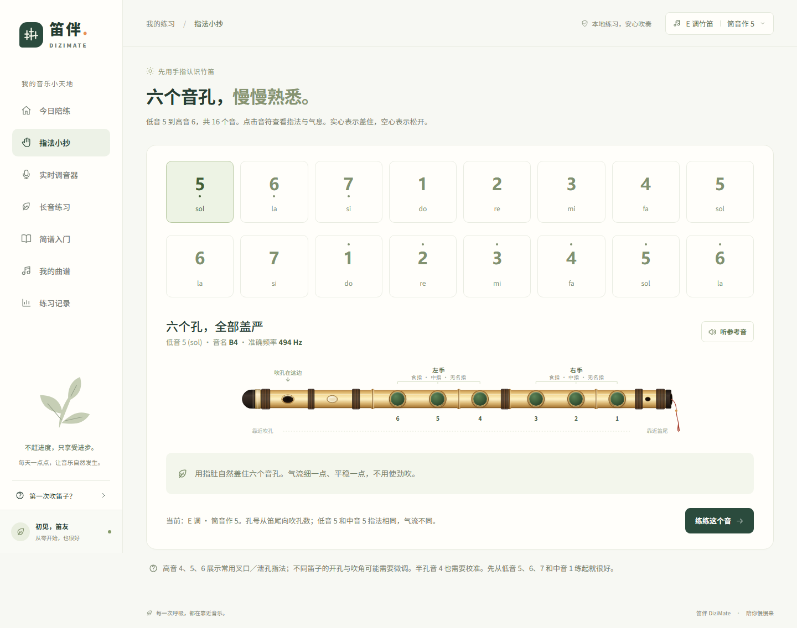
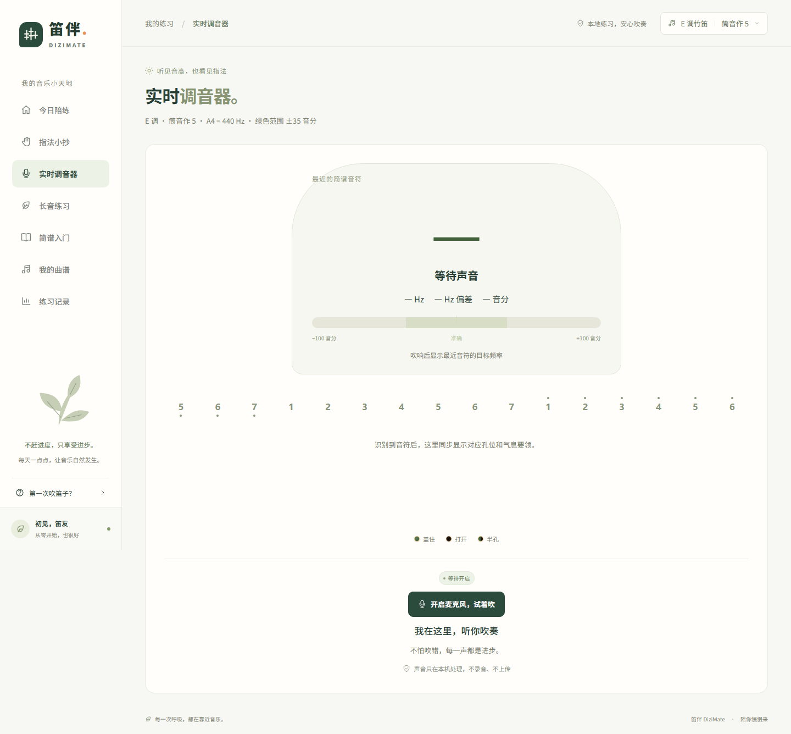
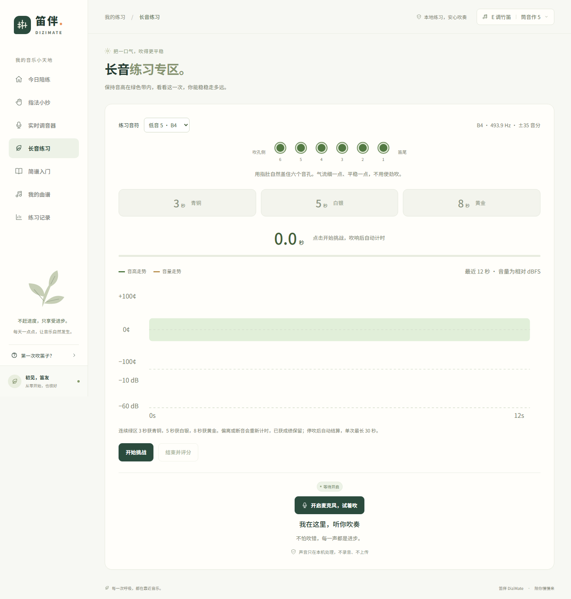
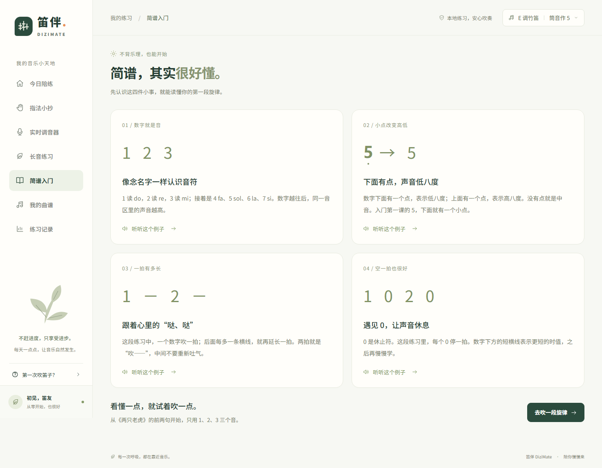
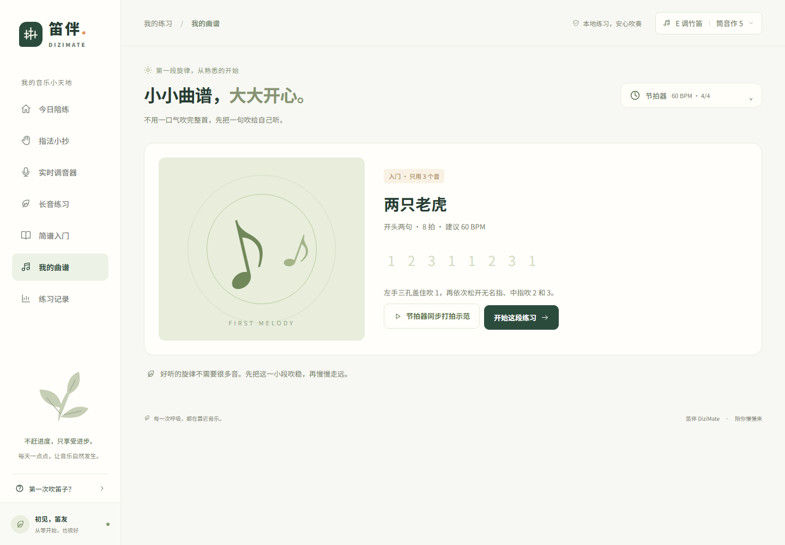
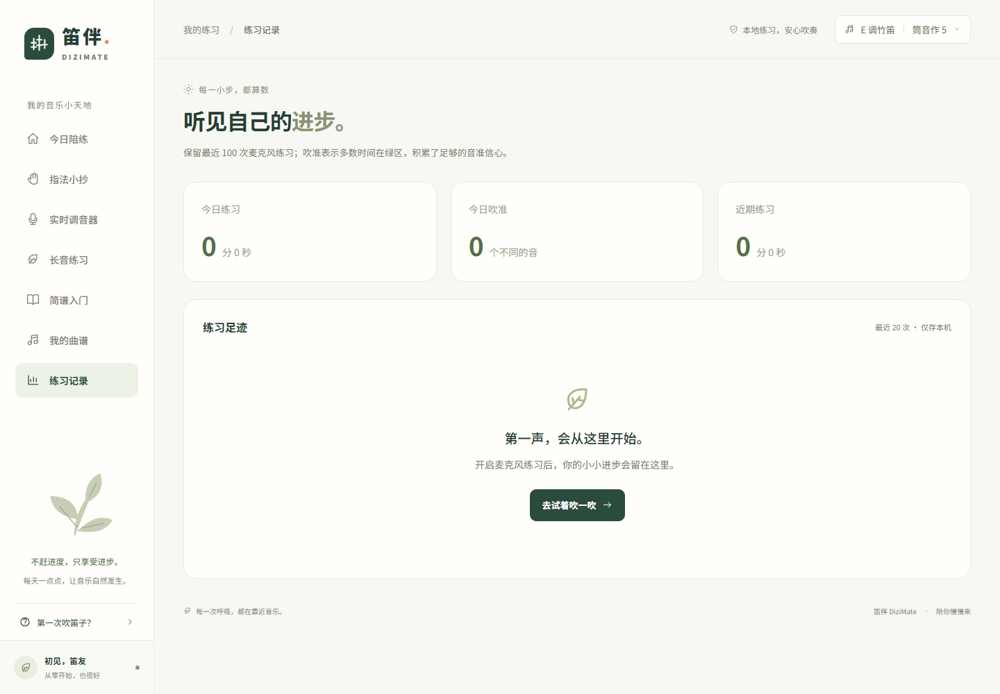
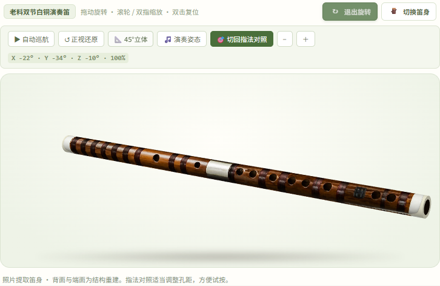

# 笛伴 DiziMate

面向竹笛零基础用户的 Web 练习台：看指法 → 听参考音 → 试着吹 → 获取音高反馈。默认 **E 调竹笛、筒音作 5**，无需账户。

## 主要页面截图

以下截图来自当前版本的桌面端页面，音高与练习数据处于未开启麦克风的初始状态。

### 今日陪练


| 指法小抄 | 实时调音器 |
| --- | --- |
|  |  |
| 长音练习 | 简谱入门 |
|  |  |
| 我的曲谱 | 练习记录 |
|  |  |

## 运行

### 笛身旋转展示



鼠标或单指拖动旋转，滚轮或双指缩放；双指扭转或 Shift + 拖动可改变笛身倾斜方向。也可使用自动巡航、预设角度、正视还原，或切回六孔指法对照。完整照片资产位于 `public/flute-double-cutout.png`、`public/flute-single-cutout.png`，由内置图像工具按「透明抠图、移除支架、横向摆正、保留竹纹缠线和原有音孔」的要求清理。

### 本地启动

Node.js 20.19+ 或 22.12+。

```sh
npm install
npm run dev
```

打开终端显示的 localhost 地址（默认 http://localhost:5173）。麦克风需要 **localhost 或 HTTPS**；手机通过普通 HTTP 局域网 IP 访问时不能使用麦克风。

```sh
npm test
npm run build
npm run preview
```

`dist/` 可部署到任意 HTTPS 静态站点。页面使用原生 JavaScript、CSS、Web Audio API 和 Vite，无运行时第三方依赖、远程字体或后端服务。

## 第一遍怎么练

1. 在右上角确认 **E 调**，检查笛膜已贴好。
2. 看六孔指法图：实心盖住、空心松开；图中吹孔在左，孔号从笛尾向吹孔依次是 1–6。
3. 点击“听听这个音”。这是合成的音高参考，不是竹笛音色录音。
4. 开启麦克风，将设备放在笛子前方约 30–50 cm，避开直接气流。
5. 六孔盖严，轻轻吹低音 5；E 调的目标是 B4，约 **493.88 Hz**。音高多数时间落在绿区，音准信心积满后会显示“吹对啦”；偶尔的微颤只会扣减少量进度。
6. 继续练低音 6、7，或者《两只老虎》前两句。练习不会强制跳音。

## 已有能力

- 笛身展示：从提供的实物照片中提取并清理双节白铜笛、单节竹笛的透明素材；点击「自由旋转展示」进入立体展示，支持鼠标／单指拖动、滚轮／双指缩放、双指扭转、自动巡航、预设角度和复位。键盘方向键旋转，Shift + 左右键扭转，+/− 缩放，Home 复位；切回指法对照后继续点击音孔。
- 展示边界：素材经 AI 辅助抠图与边缘清理，并非逐像素无损提取。立体展示使用本地 WebGL 圆柱笛身与照片纹理，背面和端面为结构重建，非实拍扫描模型；指法图调整孔距以便操作。不支持 WebGL 时降级为照片旋转，自动旋转在后台暂停，离开页面释放资源。
- 今日陪练：六孔图、目标音、合成参考音、实时频率和偏高/偏低提示。
- 指法小抄：低音 5–7、中音 1–7、高音 1–6，共 16 个音；上／下八度点、半孔、急吹与高音叉口／泄孔要领。孔位顺序统一为靠吹孔的 6 到笛尾的 1。高音区采用常用指法，不同竹笛可能需要微调。
- 实时调音器：复用 `nearestNote()`，自动高亮最近的简谱音、音名、实际 Hz、Hz 偏差和音分，并同步六孔指法与气息提示。静音时清除读数。
- 简谱入门：数字、八度点、延音线、休止符，附可播放的短示例。
- 曲谱：《两只老虎》前两句，逐音选择和节拍器同步打拍示范；练习面板与曲谱右上角都有可折叠节拍器，40–180 BPM，支持 2/4、3/4、4/4 和首拍重音。改变速度或拍号时，从第一拍重新同步。
- 长音专区：选择低音 5 到高音 6 任一音，点击开始挑战；双轨图显示最近 12 秒音高与相对音量。连续绿区 3／5／8 秒分别获青铜／白银／黄金；偏离重计连续时间，保留本次最佳成绩。停吹 0.6 秒、点击结束、达到黄金或单次达到 30 秒后生成本次得分。
- 设置：C/D/E/F/G 调、±20/35/50 音分容差、A4 430–450 Hz 校准。
- 本地记录：麦克风实际开启时长、吹准的不同音；保留最近 100 次，列表显示最近 20 次。关闭麦克风、切换页面、进入设置或页面转入后台时停止收音并保存。
- 适配桌面与手机，原生弹窗、键盘焦点、指法文字描述、减少动态效果支持。

## 音频与边界

只在用户点击后请求麦克风；音频仅经 Web Audio 在本机分析，不录制、不上传。播放参考音时暂停音高判定，避免把示范计作练习。离开页面或暂停时释放麦克风；未授权、设备缺失、设备占用或连接中断均提供提示。

输入链路为麦克风 → 150 Hz 二阶高通（Butterworth 响应）→ Analyser → YIN → 5 帧滑动中位数。中位数在对数频率域计算，抑制单帧跳八度；静音、切音、重启或示范时清空历史。检测范围约 180–3200 Hz，覆盖支持的五种调性到高音 6。音频采样使用约 70 ms 定时器，与浏览器绘制帧率解耦；页面隐藏仍会主动停止收音。

陪练使用容差积分：绿区积累，偏离以 2 倍速扣减、静音以 3 倍速扣减；容量为 1.2 秒有效积累，最近 2.4 秒观测的绿区占比还需达到 75%。超过 250 ms 的采样断档重置信心，不会把未采样时间当成绩。长音挑战单独要求连续绿区；评分为音准命中率 60%、音高标准差 25%、音量 dB 标准差 15%，尾部停吹静音不纳入评分。得分与奖牌独立：短而稳定的音可能得高分，但不会提前获得奖牌。

节拍声与旋律共用 Web Audio 时钟并提前调度，停止或离开页面会取消排队声音与界面回调。参考音期间暂停判断；独立节拍器每次点击后的 120 ms 不计入音准积分，避免拾音将节拍误当吹奏。识别面向单人、单音、较安静环境，低音量或不稳定信号不判定成功。真实竹笛的笛膜、泛音、环境与设备差异仍需要实吹校验；本应用不能判断手指是否真的盖孔、姿势、音色或气息质量。谱例是开头两句，不是整曲教学；当前旋律练习逐音判断音高，不评分节奏。

## 验证

`npm test` 使用 Node 原生测试，覆盖五种调性全 16 音、44.1/48 kHz 采样率、较强二次谐波、静音/噪声、中位数跳针抑制与换音、容差积分、长音等级／评分／中断、节拍音符同步与取消、持久化校验和麦克风授权延迟取消。

开发服务器下可打开 `/tests/audio-harness.html`，这是**不调用真实麦克风**的浏览器验收页：用 Web Audio 合成正确音、偏高音、高音 6、微颤和静音，检查实际高通频响，并模拟权限拒绝和设备中断；练习记录只写内存，不影响用户记录。该页面不包含在生产构建中。

已检查桌面/手机布局和导航、16 音指法、孔位点击、G 调高音 6 映射（E7 / 2637 Hz）、高通频响（50 Hz 约 −19 dB / 150 Hz 约 −3 dB）、实时调音器高音识别与静音清空、同步节拍和旋律高亮、8 秒黄金长音及得分，以及合成输入的稳定判定、设备中断和权限拒绝。**尚未用真实 E 调竹笛进行实吹验收。**

## 架构设计

详细的系统架构设计、分层体系、生命周期契约与架构图见：
👉 [**DiziMate 模块化分层架构设计文档**](docs/ARCHITECTURE.md)

## 文件

| 文件 | 作用 |
| --- | --- |
| src/main.js | 应用装配与全局事件监听（约 100 行轻量中枢） |
| src/shell.js | 常驻单例外壳框架（Sidebar / Topbar / Modal / Toast 零重绘） |
| src/router.js | 路由系统与页面 mount/unmount/update 生命周期驱动 |
| src/store.js | 响应式状态管理、changedKeys 差分分发与 LocalStorage 持久化 |
| src/audio-service.js | 麦克风录制、示范音合成、节拍器与高频帧流定向调度 |
| src/views/ | 7 大页面组件：练习、指法、调音器、长音、曲谱、简谱、记录 |
| src/components/ | 竹笛 SVG 物理图与交互热区、共享图标、简谱标记、节拍器控件 |
| src/practice.js | 容差时间积分（ConfidenceBucket）与长音挑战评分模型 |
| src/metronome.js | 基于音频时钟的节拍与旋律调度 |
| src/music.js | 竹笛五调性指法、音高映射与频率算法 |
| src/audio.js | 150 Hz 气流高通滤波、合成音与自相关音高检测 |
| src/style.css / src/views.css | 基础样式及模块桌面／手机自适应样式 |
| docs/ARCHITECTURE.md | 最新的模块化分层架构设计与技术文档 |
| docs/architecture.svg | 高清矢量架构设计图 |
| 	ests/*.test.js | 24 项音频算法、练习、评分、Store 及路由生命周期自动检查 |
| 	ests/audio-harness.html | 隔离的浏览器合成音验收页 |
