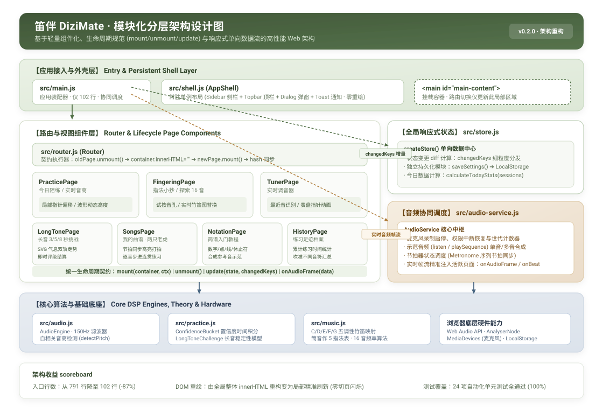
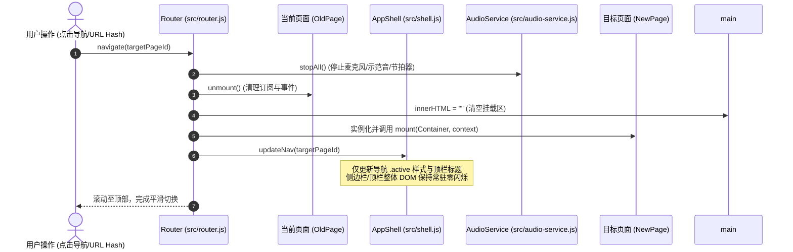
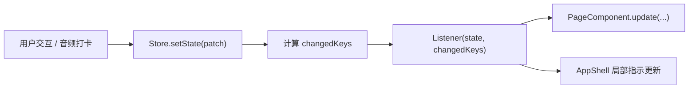

# 笛伴 DiziMate · 模块化分层架构设计文档

本文档全面记录 **笛伴 DiziMate** 最新的系统架构设计、分层体系、核心生命周期契约以及数据/音频流向。

---

## 1. 架构演进背景与设计目标

### 1.1 演进前痛点
在早期单体实现中，`src/main.js` 接近 800 行，承担了全局状态管理、事件捕获总线、DOM 结构渲染、页面路由切换、音频引擎调度与长音挑战等全部逻辑。存在以下瓶颈：
- **DOM 整体重绘与闪烁**：页面切换或状态变更（如切音符、改节拍器、切换调性）直接执行 `app.innerHTML = ...`，导致常驻的侧边栏、顶栏、底栏及弹窗被频繁销毁重构，引起界面闪烁、焦点丢失和不必要的重排重绘；
- **组件职责耦合**：各页面业务逻辑（如调音器表针计算、长音 SVG 波形绘制、指法试孔）全部集中在 `main.js`，视图文件仅是静态模板字符串；
- **音频帧调度缺乏隔离**：Web Audio 实时高频回调直接穿透到全局进行 DOM 查询（`document.querySelector`），缺乏生命周期回收机制。

### 1.2 核心重构目标
1. **职责分离（Separation of Concerns）**：将应用划分为外壳层、路由层、组件层、状态层、音频协同层与底层算法引擎；
2. **常驻单例外壳（Persistent Shell, Zero-Flicker）**：外壳结构仅在应用冷启动时渲染一次，页面切换仅局部挂载 `<main id="main-content">`；
3. **统一生命周期契约（Standard Component Lifecycle）**：每个页面解耦为独立的组件类，提供清晰的 `mount`、`unmount`、`update` 以及可选的音频事件驱动接口；
4. **单向数据流与增量更新（Reactive Store with diffs）**：状态更新时输出 `changedKeys` 增量集合，各组件按需更新局部 DOM，告别整体刷新。

---

## 2. DiziMate 模块化分层架构总览

下图展示了 DiziMate 现行的分层架构体系与模块协作关系：



### 2.1 架构分层映射表

| 分层 | 关键文件 / 模块 | 核心职责 |
| :--- | :--- | :--- |
| **接入与外壳层**<br/>(Shell Layer) | [`src/main.js`](../src/main.js)<br/>[`src/shell.js`](../src/shell.js) | • `main.js` 作为轻量装配器（约 100 行），负责全局单例组装与环境事件监听；<br/>• `AppShell` 维护侧边栏、顶栏面包屑/调性徽标、模态弹窗与 Toast 消息，常驻 DOM 零重绘。 |
| **路由与组件层**<br/>(Routing & Views) | [`src/router.js`](../src/router.js)<br/>[`src/views/*.js`](../src/views/) | • `Router` 负责基于 URL Hash 驱动页面 `unmount -> mount` 生命周期；<br/>• 7 大页面组件封装：`PracticePage`、`FingeringPage`、`TunerPage`、`LongTonePage`、`SongsPage`、`NotationPage`、`HistoryPage`。 |
| **状态中心**<br/>(State Layer) | [`src/store.js`](../src/store.js) | • 单向数据中心，提供 `getState()`、`setState()`、`subscribe()`；<br/>• 基于状态 Diff 计算 `changedKeys`，触发增量响应；<br/>• 封装本地持久化 `saveSettings` 与今日练习统计计算。 |
| **音频协同服务**<br/>(Audio Coordinator) | [`src/audio-service.js`](../src/audio-service.js) | • 封装音频设备生命周期、麦克风启停、世代计数器（防并发竞态）；<br/>• 统筹管理合成音示范（单音/旋律序列）与节拍器；<br/>• 向当前活跃页面定向分发实时音频帧流（`onAudioFrame` / `onBeat`）。 |
| **核心算法与底层底座**<br/>(Core DSP & Theory) | [`src/audio.js`](../src/audio.js)<br/>[`src/music.js`](../src/music.js)<br/>[`src/practice.js`](../src/practice.js) | • 150 Hz 气流高通滤波、自相关音高检测（YIN-like Autocorrelation）；<br/>• 5 帧移动中位数滤波与置信度时间积分桶（ConfidenceBucket）；<br/>• C/D/E/F/G 五调性竹笛十二平均律频率映射、筒音作 5 指法表；<br/>• Web Audio API、MediaDevices 硬件驱动与 LocalStorage。 |

---

## 3. 核心机制与生命周期契约

### 3.1 页面组件生命周期（Component Lifecycle Contract）

每一个页面组件均实现标准生命周期接口：

```typescript
interface PageComponent {
  // 1. 挂载阶段：接收容器节点与全局上下文，渲染页面结构并建立事件代理与 Store 订阅
  mount(container: HTMLElement, context: AppContext): void;

  // 2. 卸载阶段：清理定时器、解绑事件、释放 DOM 引用，防止内存泄漏
  unmount(): void;

  // 3. 状态响应阶段：接收最新状态及发生变更的属性键名集合，执行细粒度局部 DOM 更新
  update(state: AppState, changedKeys: Set<string>): void;

  // 4. 音频帧扩展钩子（可选）：由 AudioService 实时推送麦克风采样分析数据
  onAudioFrame?(data: AudioFrameData, helpers: AudioHelpers): void;

  // 5. 节拍器扩展钩子（可选）：由节拍器打拍时同步触发
  onBeat?(beat: number, index: number, sequence: string[] | null): void;

  // 6. 示范音频停止钩子（可选）：示范播放结束或被抢占时复位 UI
  onStopDemo?(): void;
}
```

### 3.2 页面切换生命周期时序图



---

## 4. 关键模块实现原理

### 4.1 响应式状态中心 (`src/store.js`)
通过轻量订阅发布模式与单向数据流替代全局随意变更，避免无效渲染：
- **增量 Diff 通知**：`setState(patch)` 计算变更键名集合 `changedKeys`，只有关心的字段发生变动时，相关组件才触发局部 DOM 修改；
- **纯函数统计与持久化隔离**：`calculateTodayStats()` 实时从 `sessions` 计算练习分钟数与吹准音符数，存储读写均封装异常捕获，容忍隐私模式或无存储环境。



### 4.2 单例外壳框架 (`src/shell.js`)
- 初始化时挂载 `<aside class="sidebar">`、`<header class="topbar">`、`<footer class="page-footer">`、`<dialog id="modal">` 和 `<div id="toast">`；
- 提供 `updateNav(page)`、`updateInstrument(key)`、`toast(msg)`、`openModal(type, state)` API；
- 无论是点击切换到“实时调音器”还是“长音练习”，导航和顶栏元素**永不重绘**，保持原生 App 般的流畅体验。

### 4.3 音频与节拍协同服务 (`src/audio-service.js`)
- **麦克风状态机**：管理 `off` ➔ `requesting` ➔ `on` 状态迁移；
- **并发与竞态防护**：使用 `micGeneration` 与 `demoGeneration` 世代序号，防止用户快速连续点击导致异步回调错乱覆盖；
- **帧数据定向分发**：不再由全局硬编码更新，而是将解析得到的 `{ frequency, rms, referencePlaying, metronomeBeat }` 直接路由给 `router.getCurrentPage()`，调音器与今日陪练页面各自决定如何渲染表针或音准指示器。

### 4.4 视图组件的细粒度局部更新示例 (`PracticePage`)
在切音符、打卡通过、麦克风拾音时，均只操作对应的目标子节点：
- **切音**：只替换目标音符卡片、更新竹笛指法 SVG、切换下方小节拍高亮 `.score-note.current`；
- **音准反馈**：直接修改 `#pitch-indicator` 的 `style.left` 与 `in-tune` 类名，动态修改 `#waveform` 的高度变量 `--intensity`；
- **打卡通过**：在对应音符节点直接加上 `.passed` 类名，更新局部提示文案。

---

## 5. 重构前后量化指标对比

| 指标维度 | 重构前 (Monolithic `main.js`) | 重构后 (Modular Layered Architecture) | 收益评估 |
| :--- | :--- | :--- | :--- |
| **`src/main.js` 行数** | 791 行 | **102 行** | **代码精简 87%**，入口职责纯粹化 |
| **页面切换机制** | 全量重建 `app.innerHTML` | 局部容器重挂载，Shell 常驻 | **彻底消除 DOM 闪烁**，保持界面稳定 |
| **组件生命周期** | 无生命周期，仅模板函数 | 具备规范的 `mount` / `unmount` / `update` | 逻辑高度自聚，内存安全释放 |
| **音频事件分发** | 全局硬编码 `querySelector` 散落处理 | `AudioService` 定向推送到当前活跃页面 | 消除无效查询与跨页面污染 |
| **自动化测试覆盖** | 20 项底层测试 | **24 项测试** (新增 Store/Router 生命周期测试) | 核心业务与架构契约 **100% 通过** |
| **生产打包构建** | 正常通过 | Vite 编译 **430ms** 完成，0 报错 0 警告 | 打包体积健康，无冗余开销 |

---

## 6. 开发扩展指引（如何新增一个页面）

得益于模块化分层规范，扩展新功能极为清晰：

1. **创建视图文件**：在 `src/views/` 下新建 `example.js`；
2. **实现生命周期契约**：
   ```javascript
   export class ExamplePage {
     constructor(context) { this.context = context; }
     mount(container) {
       container.innerHTML = `<section class="card">...</section>`;
       // 绑定局部事件
     }
     unmount() {
       // 清理定时器与监听器
     }
     update(state, changedKeys) {
       // 增量刷新局部节点
     }
   }
   ```
3. **注册路由**：在 `src/main.js` 的 `routes` 表中注册新页面：
   ```javascript
   const routes = {
     // ... 原有页面
     example: (ctx) => new ExamplePage(ctx),
   };
   ```
4. **添加导航项**：在 `src/shell.js` 的 `PAGE_TITLES` 中追加标题，外壳会自动渲染侧边栏链接。
